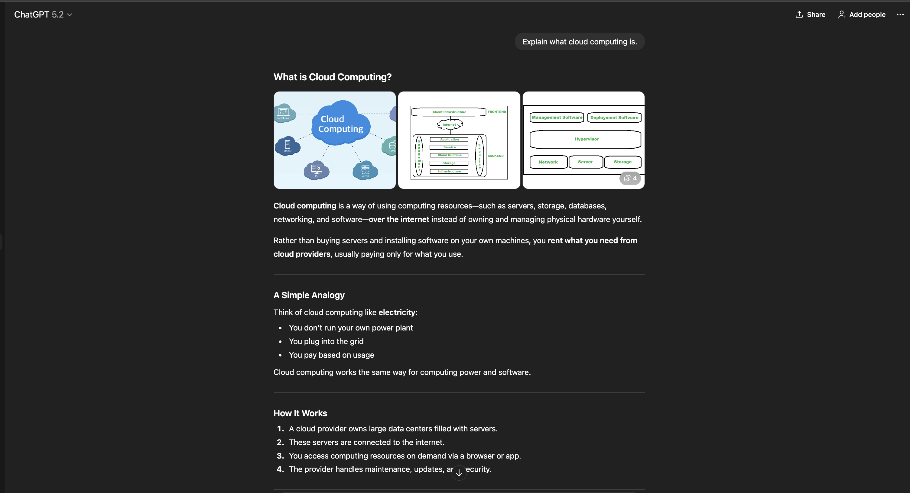

# Prompt Evaluation Lab

## Overview
This project evaluates how different prompt designs affect
accuracy, verbosity, and hallucination risk for the same task.

The same task is executed using multiple prompt variants,
and outputs are compared using defined evaluation criteria.

## Task
Explain what cloud computing is to a non-technical audience.

## Prompt Variants
- Baseline prompt (minimal instruction)
- Constrained prompt (limits and rules)
- Structured prompt (explicit output structure)

## Outputs

### Baseline Prompt Output

### Constrained Prompt Output

### Structured Prompt Output

## Evaluation Summary

| Prompt Type | Accuracy | Verbosity | Hallucination Risk |
|------------|----------|-----------|--------------------|
| Baseline | Medium | High | Medium |
| Constrained | High | Medium | Low |
| Structured | High | Low | Low |

## Key Takeaways
- Adding constraints improves reliability
- Structured prompts reduce hallucination risk
- Prompt design significantly impacts output quality
